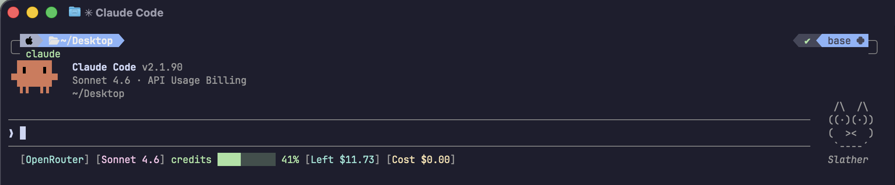

# claude-openrouter-hud

A Claude Code plugin that shows your OpenRouter spend and remaining credits in a `claude-hud`-style statusline. Always visible below your input.
---

---
## What is claude-openrouter-hud?

`claude-openrouter-hud` gives you a compact OpenRouter-specific HUD inside Claude Code.

| What You See | Why It Matters |
|--------------|----------------|
| **Model name** | Confirm exactly which model the current session is using |
| **Credits bar** | See at a glance how much of your OpenRouter credits pool is already consumed |
| **Remaining balance** | Know roughly how much account credit is left |
| **Session cost** | Track the spend of the current Claude Code session without opening the OpenRouter dashboard |

## What You See

### Default output
```text
[OpenRouter] [claude-4.6-sonnet] credits ████░░░░░░ 40% [Left $12.00] [Cost $0.1212]
```

- `[OpenRouter]` — static label so the HUD is easy to spot in mixed setups
- `[claude-4.6-sonnet]` — model name from OpenRouter generation metadata
- `credits ████░░░░░░ 40%` — credits depletion progress based on account usage
- `[Left $12.00]` — remaining credits, calculated from the OpenRouter credits endpoint
- `[Cost $0.1212]` — cumulative spend for the current Claude Code session

---

## Install

Inside a Claude Code instance, run the following commands:

**Step 1: Add the marketplace**

```text
/plugin marketplace add ToeleoT/claude-openrouter-hud
```

**Step 2: Install the plugin**

```text
/plugin install claude-openrouter-hud
```

**Step 3: Configure the statusline**

```text
/claude-openrouter-hud:setup
```

If you already have a `statusLine` configured, setup stops instead of overwriting it. That is intentional.

Done. Restart Claude Code to load the new `statusLine` config, then the HUD will appear.

---

### Fallback when credits are unavailable
```text
[OpenRouter] [claude-4.6-sonnet] [Cost $0.1212]
```

If the authenticated key cannot access the credits endpoint, the HUD still shows session spend and the model name.

---

## Requirements

- Claude Code with plugin support and native `statusLine` support
- Node.js 18+ or Bun available in the shell that launches Claude Code

The plugin prefers Bun and falls back to Node.js automatically.

To authenticate OpenRouter requests,  you need already finishing https://openrouter.ai/docs/guides/coding-agents/claude-code-integration.

For the credits bar and remaining balance, prefer an OpenRouter management or provisioning key. Basic keys may still work for generation cost while failing to read account credits.

## Runtime

- `bun` preferred: runs `src/index.ts` directly
- `node` fallback: runs `dist/index.js`

If setup says no JavaScript runtime was found, install one for your shell first. The simplest fallback is Node.js LTS.

---

## Configuration

### Setup

Run:

```text
/claude-openrouter-hud:setup
```

The setup command:

- detects the latest installed plugin version
- prefers `bun` and falls back to `node`
- writes a `statusLine` entry only when one is not already present
- stops safely if another statusline is already configured

### Manual configuration

If you prefer to set `statusLine` yourself, point it at the installed plugin version in Claude's plugin cache and run either:

- `src/index.ts` with `bun`
- `dist/index.js` with `node`

The generated command in setup already does this dynamically so plugin updates keep working without hardcoding a version.

---

## Removal

Run the cleanup command first:

```text
/claude-openrouter-hud:teardown
```

Then remove the installed plugin and marketplace:

```text
/plugin uninstall claude-openrouter-hud -s user
/plugin marketplace remove claude-openrouter-hud
```

`teardown` only removes `statusLine` when it still points at `claude-openrouter-hud`. If your `statusLine` has already been changed to something else, it leaves your settings alone.

---
